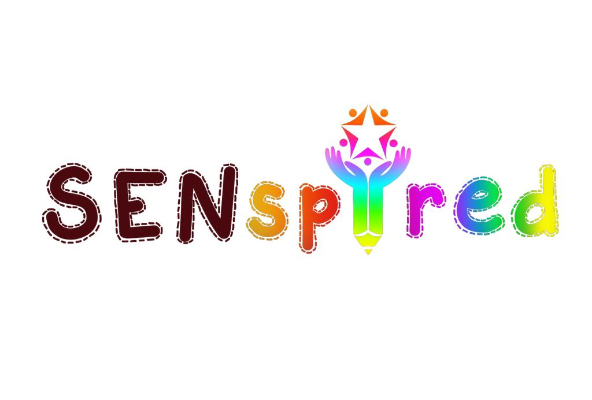
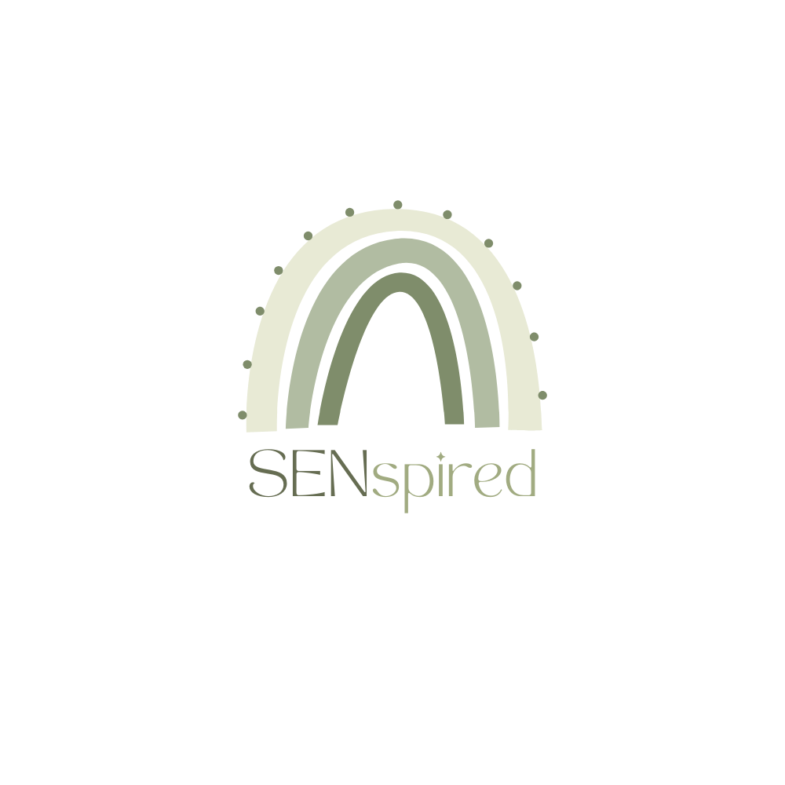
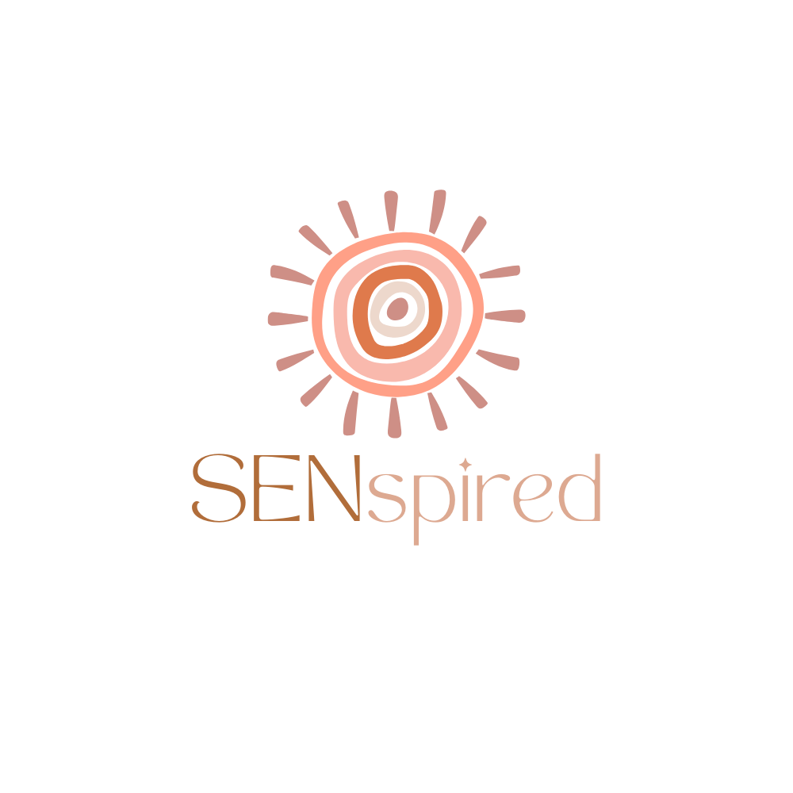
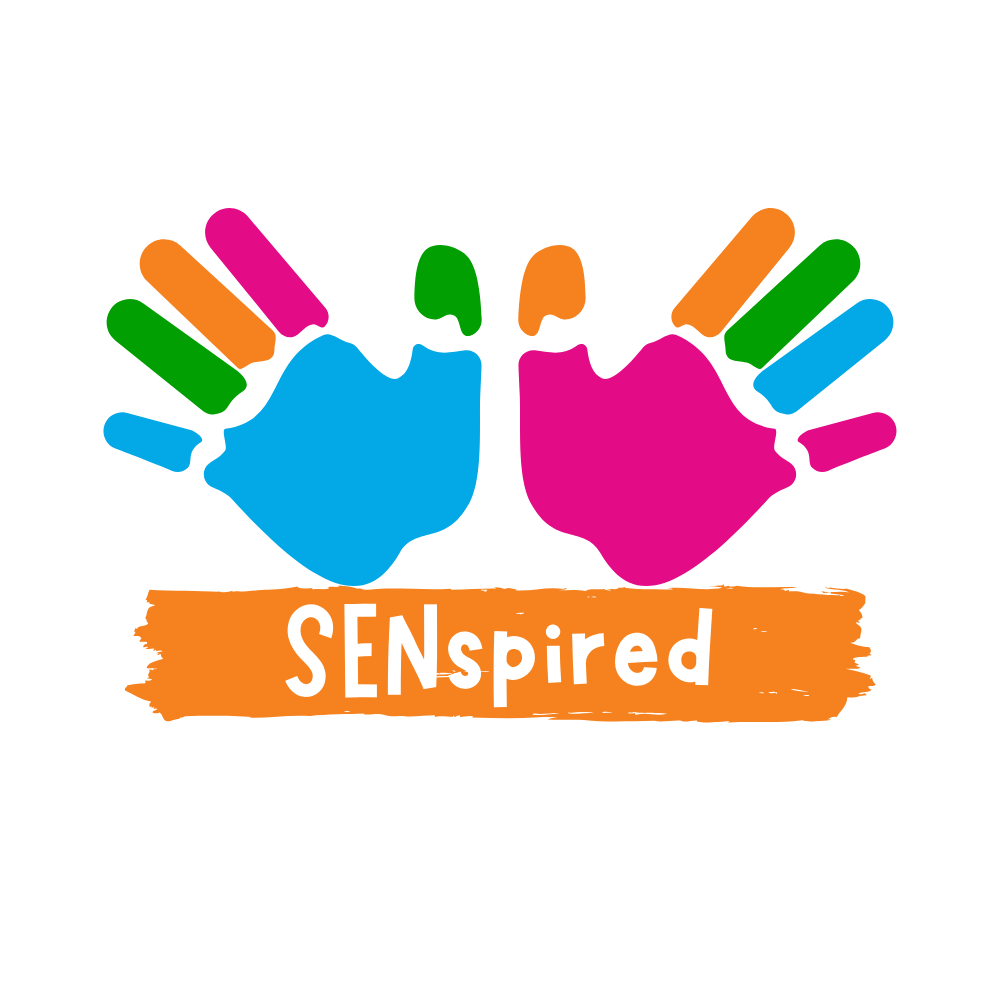
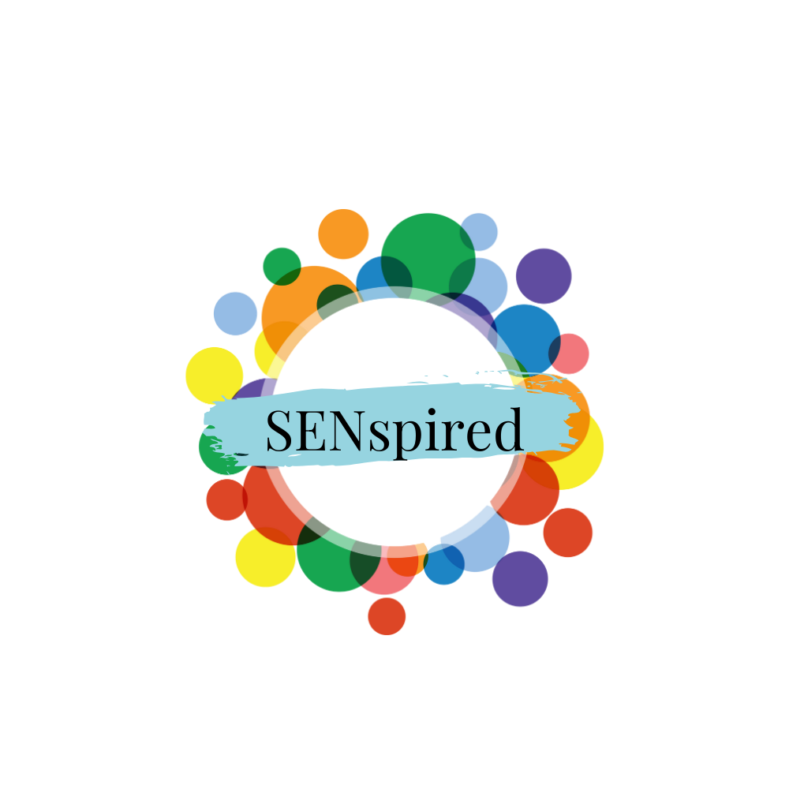
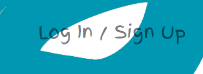

SENspired, my latest web development endeavour, embodies the principles of Agile methodologies, fostering a dynamic and collaborative relationship with a real client. Our weekly meetings served as a platform for transparent communication and feedback, allowing for constant iteration and refinement of the website's features. Notably, the site boasts a robust event management system, providing administrators with a user-friendly interface to effortlessly create, modify, and remove events. This functionality ensures a streamlined and efficient booking process for the public, aligning perfectly with SENspired's mission.

Moreover, I have implemented a sophisticated system empowering users to manage booking requests for the organisation's rented rooms. This comprehensive solution enables individuals to seamlessly create, read, update, and delete their booking requests, enhancing the overall user experience. The design of the platform goes beyond functionality, incorporating a stylish aesthetic that reflects the organisation's ethos.

While the website's current iteration showcases the initial CRUD (Create, Read, Update, Delete) functionality for both administrators and users, it represents just the tip of the iceberg. The project's expansive scope necessitates a phased approach, and this initial release serves as a preview of the site's potential. As I continue to work on expanding its capabilities, I am excited about the positive impact SENspired will have on its users and the community it serves. The journey is ongoing, and I look forward to bringing even more innovative features and enhancements to the site in the future.

 

 
 

Please access the website through this link: [SENspired](https://senspired-efbab7dd64be.herokuapp.com/).

 

# Contents

- [Project](#project)
  - [Objective](#objective)
  - [Site User's Goal](#site-users-goal)
  - [Site Owner's Goal](#site-owners-goal)
  - [User Experience (UX) user](#user-experience-ux-user)
  - [Primary Goal](#primary-goal)
  - [First Time Visitor](#first-time-visitor)
  - [Returning Visitor](#returning-visitor)
  - [Frequent Visitor](#frequent-visitor)
  - [User Experience (UX) Site owner](#user-experience-ux-site-owner)
  - [User Stories](#user-stories)
  - [Project Management](#project-management)
- [First Client Meeting](#first-client-meeting)
    - [User Access / Admin Access](#user-access--admin-access)
    - [Current web design](#current-web-design)
    - [Next Steps](#next-steps)
    - [Creative Process](#creative-process)
    - [Logo Design](#logo-design)
        - [Current Logo](#current-logo)
        - [New logo Designs](#new-logo-designs)
    - [Design Prototype](#design-prototype)
      - [Wireframes](#wireframes)
          - [Desktop](#desktop)
          - [Mobile](#mobile)
- [Second Client Meeting](#second-client-meeting)
    - [Design Choices](#design-choices)
        - [Typography](#typography)
        - [Color Scheme](#color-scheme)
    - [Database Schema (ERD)](#database-schema-erd)
        - [Models](#models)
- [Third Client Meeting](#third-client-meeting)
    - [Site Structure](#site-structure)
    -  [Features](#features)
      - [Navigation](#navigation) 
          - [The Logo](#the-logo)
          - [The Menu](#the-menu)
          - [Log In / Sign In](#log-in--sign-in)
            - [Log In / Sign In Menu](#log--sign-in-menu)
            - [Admin Menu](#admin-menu)
            - [User Menu](#user-menu)
          - [Footer](#footer)
          - [User Side Site](#user-side-site)
 
    - [Future Features Sign in functionality](#future-features-sign-in-functionality)
  - [403, 404 and 500 Error Pages](#403-404-and-500-error-pages)
  - [Future Features](#future-features)

- [Technologies Used](#technologies-used)
  - [Languages](#languages)
  - [Frameworks and Software](#frameworks-and-software)
- [Python Packages](#python-packages)
- [Testing](#testing)
  - [Debugging](#debugging)
    - [Manual testing](#manual-testing)
    - [External Testing](#external-testing)
    - [Automated Testing](#automated-testing)
- [Project Deployment](#project-deployment)
  - [Create a new GitHub Repository from CI template](#create-a-new-github-repository-from-ci-template)
  - [Install Django and the supporting libraries](#install-django-and-the-supporting-libraries)
  - [ElephantSQL Database](#elephantsql-database)
  - [Cloudinary API](#cloudinary-api)
  - [Heroku Deployment](#heroku-deployment)
  - [To fork the repository on GitHub](#to-fork-the-repository-on-github)
  - [To create a local clone of a project](#to-create-a-local-clone-of-a-project)
- [Credits](#credits)
  - [Content](#content)
  - [Media](#media)
  - [Acknowledgements](#acknowledgements)

[Back to top](#contents)

# Project

### Objective

I've developed a strong passion for coding, finding immense enjoyment in this project. The site's potential is vast, with an ongoing scope. Inspired by my children's involvement in a kids' group, I collaborated with the organisers to create a platform tailored to their needs. Although the site currently focuses on individual tasks for admins and users, the project is set to evolve further.

My goal in this development was to leverage my skills in HTML, CSS, JavaScript, Python, Bootstrap, and the Django Framework. While the booking system and search functionality are works in progress, the project already features several custom models with complete CRUD functionality. The next version will see enhancements to both the booking system and search functionality, continuing to elevate this project.

### Site Users Goal

As a site user, my primary desire is to effortlessly book events and seamlessly request a room for personal use, with the added convenience of receiving updates when I click on the respective features.

### Site Owners Goal

As the site owner, my goal is to easily create events, providing comprehensive information such as the event name, time, destination, and additional details for user clarity. Additionally, I aim to efficiently manage booking requests from the public, having the ability to approve or deny them as needed.

[Back to top](#contents)

# User Experience (UX) User

### Primary Goal

The site's primary goal for users is to effortlessly stay informed about SENspired events and easily submit booking requests for the available rooms.

### First Time Visitor

-  When A first time user arrives on the the index page, it hits you with a burst of colors and a bunch of cool features. It's like a lively playground, with loads of different things to check out and explore.
- A user can register, log in and logout.
- A user can see events. 
- A user can see details of events including an dates, address and time when they have signed in.
- A signed in user can create a booking request for the SENspired room. 
- A signed in user can update, read and delete their booking request. 
- A signed is user can see the status of their booking request on the my bookings page.
- A user is informed about a successful booking.
- A user can go onto their booking page to see all events booked and see the requests for any room bookings.
- A user can add/edit/delete their contact information which can be accessed from the Profile Icon on the right. They are informed about having created, updated or deleted their Contact info.
- A user can access useful information in the footer:
    - Links to social media
    - Opening hours
    - Site navigation
    - Contact information
    - My website
- A user can see the coming soon pages so know that the site is currently under maintenance. 

### Returning Visitor

- A user can easily sign in and access majority of the features of the website.
- A user with filled in Contact info can also register for an event.
- A user can make requests to book the room. 

### Frequent Visitor

- A frequent user can check the events and register for the new ones.
- a frequent user can make room booking requests.

### User Stories
- As a **user**, I would like to **view the apps homepage** so that I can **learn about the app and see what services it provides**.
- As a **user** I can **locate the navigation area** so that I can **easily access different parts of the website**
- As a **user**, I can **access relevant information about contact information and social media links without having to scroll back to the top of the page** so that I can **visit SENspired, contact SENspired and follow SENSpired online**.
- As an **unregistered user** I want to be able **to sign up onto the website** so that I can **access websites functionality and content**.
- As a **registered user** I want to be able **to sign in into my account** so that I can **get access to the website's functionality and options**.
- As a **signed in user** I want to be able **to sign out of my account** so that I can **keep my account private and safe**.
- As a **signed in user with an active profile** I can **create a booking request** so that **I can see the my bookings area to check in for updates.**
- As a **user**, I can **edit my booking request** as long as the status isn't approved, to **update my preferences regarding the booking time, date and name**.
- As a **registered user** I can **press delete button on my request** so that I can **delete all provided information regarding my booking**
- As a **registered user** I can **press delete button on my user profile** so that I can **delete all provided information regarding my contact details**.
- As a **user**, I can **edit my user profile** to **update my personal details**.
- As a **user** I can **open the events booking** so that I can **register for an event**.
- As a **user** I can **be visually attracted to the app and see the main site features** so that I can **quickly get an idea what the app offers**.
- As a **user I want to be informed about different user actions** so that I can **be sure that the intended action took place**.
- As a **user** I can **enjoy browsing the webpage while looking for information** so that **I don't feel compelled to leave**.
- As a **user** I want to **press a cancel button which will take me to the previous page** so that I **don't have to use the Back button**.
- As a **user** I can **easily understand what the table labels mean** so that I can **avoid any unnecessary confusion**.

 

[Back to top](#contents)

# User Experience (UX) Site owner / Admin

### User Stories

- As the **site owner**, I want to be able to **sign in to my account so that I can get access to the website's functionality and options**.
- As a **signed-in site owner**, I want to be able to **sign out of my account so that I can keep my account private and safe**.
- As a **signed-in site owner** via the **admin panel**, I can **create events with a name, description, time, date and image**.
- As a **signed-in site owner** via the **admin panel** , I can **Edit the events name, description, time, date and image**.
- As a **signed-in site owner** via the **admin panel**, I can **delete the events name, description, time, date and image**.
- As a **signed-in site owner** via the **admin panel**, I can **View requests made by general users for room bookings**.
- As a **signed-in site owner** via the **admin panel**, I can **approve requests made by general users for room bookings**.
- As a **signed-in site owner** via the **admin panel**, I can **delete requests made by general users for room bookings**.

[Back to top](#contents)

# Project Management

I challenged myself to complete this project within a timeframe of four weeks. To effectively manage the project, I employed a combination of strategic tools.

Firstly, I established a routine of weekly meetings with the client, fostering regular communication and alignment on project goals.

Secondly, I implemented a goal-oriented approach by setting clear objectives for each week, directly derived from the outcomes of our client meetings. This provided a structured framework for progressing through the project.

For task management, I opted for Apple's To-Do list, finding it to be a user-friendly and efficient tool. This choice was made in lieu of Github's project board, as my dynamic work style and frequent engagement in meetings were better accommodated by the To-Do list.

This multi-faceted approach allowed for seamless communication with the client, systematic goal achievement, and efficient task management throughout the project timeline.

[Back to top](#contents)

# First Client Meeting

In the first client meeting, our focus was on defining the desired outcomes and scoping the project for the website. We delved into a comprehensive discussion covering various aspects, including User Access, Admin Access, feature requirements, considerations for safeguarding and cookies, an in-depth analysis of the existing website – highlighting its strengths and weaknesses, and a meticulous review of all images and the current logo. This holistic exploration set the foundation for a purposeful and well-informed project trajectory.

### User Access / Admin Access

Regarding access, the client expressed a clear vision for a robust admin side, necessitating the creation of an indispensable admin panel. This tool was deemed essential for seamless event management, allowing the admin to not only create events but also control their visibility – deciding whether to keep them hidden or make them live based on the desired timing for public access.

Additionally, catering to basic user access was a key requirement. This functionality empowers users to view their booked events while concurrently offering the admin insights into the attendees for each event. This dual-layered access system was designed to provide a comprehensive and user-friendly experience for both administrators and regular users.

## Current web design

During our evaluation of the current website, we identified notable strengths and areas for improvement.

Positive Aspects (Good):

- Ease of Accessibility: The existing website excelled in providing easily accessible information.
- Visual Appeal: The vibrant and colourful design contributed to an engaging user experience.
- User Guidance: The directions on the site were reasonably easy to recognize, enhancing user navigation.

Areas for Improvement (Bad):

- Colour Palette: Identified issues with the colour palette, indicating room for enhancement.
- Logo Absence: The absence of a logo was noted as a shortcoming.
- Visual Appeal: Described as bland, the website lacked visual dynamism.
- Clarity of Purpose: The site struggled to effectively communicate and detail SENspired's services and offerings.
- Page Loading Time: Slow loading times were observed, indicating a need for optimization.
- Booking Information: The booking confirmation lacked crucial details such as time and date.
- Class Session Limitation: Users expressed a desire for the ability to add more classes or sessions during the booking process.

Considering these insights, the vision for the future website encompasses enhancements in design aesthetics, optimization for faster performance, and the incorporation of additional features to meet user expectations.

<b>Current Home Page</b>

 

### Next Steps

- **Create new logo designs**
- **Create different wireframes of different designs**

 
 

[Back to top](#contents)

# Creative Process

Below, I'll showcase the evolution of the index page prototypes, illustrating the iterative journey of its development. Explore the visual transformations that have unfolded over time, providing insights into the thoughtful enhancements and refinements made to craft an engaging and user-friendly landing experience.

## Logo Design

### Current Logo

The existing SENspired logo falls short in effectively communicating the organization's activities. The motivation behind redesigning the logo is not only to accurately depict the essence of what SENspired does but also to craft a visually engaging and playful design that can serve as a powerful branding element. The redesign aims to encapsulate the spirit of SENspired while creating a distinctive and memorable visual identity.

<b>Current Logo</b>

### New Logo Designs

In this opening segment, we'll display a variety of logo options, exploring different styles and colors, drawing inspiration from the current logo.

<b>New logos inspired by the current logo</b>

 

 
 
 
 
 
 
 
 
 
 
 
 
 
 
 
 
 

 

The following represent comprehensive redesigns of the logo, infused with a depiction of SENspired's activities and the potential for a fresh branding approach.

<b>Redesigned logos</b>

      

 

[Back to top](#contents)

## Design Prototype

### Inspiration

The following websites served as the foundational inspiration for the creation of the initial wireframes. They played a key role in shaping the design direction and layout for this project.

<b>Websites for Inspiration</b>

 

[Messy Monkeys](https://messy-monkeys.com/messy-play/)
 

[Little Learners](https://littlelearnersuk.com/)
 

[Mucky Mitts](https://www.muckymitts.co.uk/)
 

[Messy Pods](https://www.messypods.co.uk/)
 

[Bablands](https://bablands.com/tag/messy-play/)
 

[Sensory Land](https://www.sensoryland.com/messy-play-activity-classes)
 

[Thimble and Twig](https://thimbleandtwig.com/mark-making-and-messy-play-with-little-learners/)
 

[Little Rainbows](https://www.littlerainbowsbabysensory.co.uk/)
 

 

[Back to top](#contents)

## Wireframes

The wireframes presented below were meticulously crafted using [Balsamiq Wireframes](https://balsamiq.com/). In these designs, I aimed to capture the essence of "messy play" while simultaneously providing users with an immediate understanding of SENspired's mission and offerings at first glance.

### Desktop

<b>Desktop Wireframes</b>

 

### Mobile

<b>Mobile Wireframes</b>

 

# Second Client Meeting

In the second meeting, I presented the client with the newly designed logos and wireframes, showcasing the considerable effort invested in the redesign. Despite the initial setback of the client choosing to retain the current logo, the meeting marked a notable step forward in the project's progression.

We collaboratively reviewed the wireframes and successfully identified a preferred design to move forward with, signifying a positive outcome.

Following a brief discussion on the next steps, I communicated my plan to commence backend development, preparing the groundwork for the subsequent frontend tasks. 

### Next Steps
- Sort design choices for the site including; Typography and colour schemes.
- Setting up Django as the backend framework.
- Installing necessary additions, including all.auth for authentication and cloudinary for media management.
- Creating a database through ElephantSQL.
- Setting up the initial models, views, and URLs to establish the foundational structure for the backend.

These steps mark the initiation of the technical implementation phase, laying the foundation for the frontend development and bringing us closer to the realization of the project goals.

** **We also decided that for the purposes of this project, I would work on two aspects of CRUD (create, read, update and delete). One for the general user and one for the Admin.** **

## Design Choices

The selection of design elements, notably the color scheme and typography, serves as a pivotal cornerstone in sculpting the visual identity and user experience of any website or application. These choices not only contribute to the aesthetic appeal but also wield the power to evoke specific emotions, establish brand recognition, and guide users seamlessly through their digital journey. In the realm of SENspired, every design decision has been meticulously considered to ensure a harmonious blend of visual allure and functional excellence, fostering an inclusive and engaging platform for its diverse audience. Let's delve into the rationale behind these carefully crafted design choices.

### Typography

**Typeface Selection:**
 
The choice of typeface contributes significantly to the overall tone and readability of the content.

**Font Sizes and Styles:**
 
Font sizes are optimized for easy readability, with distinct styles (e.g., bold, italics) used sparingly to emphasise important information. This approach ensures a pleasant reading experience for users across different devices.

**Consistency:**
 
Maintaining consistency in typography across the website fosters a cohesive and polished look. Consistent font sizes, line heights, and spacing contribute to a visually harmonious design.

**Responsiveness:**
 
Typography is designed to be responsive, adapting gracefully to different screen sizes and resolutions. This ensures a seamless reading experience for users on desktops, tablets, and mobile devices.

The following choices were the shortlisted options;

<b>Typography options</b>

[Title](README.md) .png>) .png>) .png>) .png>)

The chosen typeface balances readability with a touch of whimsy, enhancing the overall friendliness and accessibility of the site. The soft approach in design is not just an aesthetic choice but a deliberate effort to create an environment where children and their families feel welcomed and at ease while exploring the diverse activities offered by SENspired.

## Colour Scheme

**Rationale:**
 
Selecting an appropriate color scheme is essential for conveying the right emotions and brand identity. In the case of SENspired, the color scheme was chosen with careful consideration.

**Primary Colors:**
 
The chosen primary colors aim to evoke a sense of vibrancy and energy, aligning with the lively and engaging nature of the activities and services provided by SENspired.

**Accent Colors:**
 
Accent colors are strategically used to highlight important elements, creating a visual hierarchy and guiding users' attention to key areas such as calls-to-action and essential information.

**Accessibility:**
 
Ensuring accessibility is a priority, with attention given to color contrast to accommodate users with varying visual abilities. This aligns with the inclusive values of SENspired.

With that in mind, the following colours were chosen for the scheme;

<b>Colour Scheme Options</b>

.png>) .png>) .png>) .png>) .png>)

 

Opting for a pastel color scheme was a deliberate choice aimed at infusing the SENspired platform with a soft and approachable ambiance. Pastel colors, known for their muted tones and gentle hues, exude a calming and nurturing atmosphere. These colors not only contribute to the visual appeal of the site but also align seamlessly with the nature of children's activities, fostering a comforting environment for both young participants and their families.

The pastel palette, with its subtlety and versatility, extends beyond mere aesthetics. It plays a crucial role in creating a visually cohesive and harmonious user experience, promoting a sense of tranquility and fostering engagement. This intentional use of color reflects the commitment to providing a welcoming and inclusive space for children, where the visual elements complement the overall mission of SENspired.

## Database Schema (ERD)

Showcasing the Database Schema Entity-Relationship Diagram (ERD) is a crucial step in elucidating the underlying structure that supports the functionality of SENspired. Utilising [Lucid Chart](www.lucidchart.com) for the creation of the ERD ensures a clear and visually comprehensible representation of the relationships between different entities within the database.

The ERD serves as a visual roadmap, delineating how various pieces of information interconnect, enabling a comprehensive understanding of the data architecture. Each entity in the schema signifies a distinct component, while the relationships elucidate how these components interact with one another, forming a cohesive system that underpins the functionality of SENspired.

This graphical representation not only aids in the visualization of the database structure but also provides an insightful reference for developers and stakeholders involved in the project. The use of Lucid Chart adds an extra layer of clarity and accessibility, facilitating effective communication and collaboration throughout the development process.

<b>Database Scheme ERD Diagram</b>

## Models

The creation of the Entity-Relationship Diagram (ERD) schema proved indispensable for shaping the models within the SENspired app. This carefully designed schema not only illuminated intricate relationships between various apps and models but also clarified the necessary fields for each component.

Navigating this ERD schema provided crucial insights into the dynamics of app interactions, guiding the definition of relationships and fields for a seamless data architecture. Subsequently, I utilised the ERD to generate a comprehensive model, incorporating all project apps, including Django's built-in models. This iterative process refined relationships and solidified the overall project structure, serving as a dynamic reference point throughout development and enhancing the understanding of the app's data landscape.

In the project, I employed the following key models to facilitate various functionalities:

**Event:**
 
Geared towards staff members, this model enables the creation of events. Staff members can use this model to provide details about upcoming activities and sessions.

**Attendee:**
 
Catering to signed-in users, the Attendee model plays a crucial role in showcasing user attendance on the administrative side. This ensures that staff members can easily track and manage event participation.

**Booking:**
 
Purpose: SENspired's dedicated space. This model serves as the backbone for users to express their interest in securing a spot for their intended activities.

These models collectively contribute to the seamless functioning of SENspired, empowering staff members with event creation capabilities, enabling user attendance tracking, and facilitating the booking process for the community.

# Third Client Meeting

In our third meeting, I communicated my intention to only develop functionalities allowing admins to create events and users to initiate room booking requests. This pivotal step aimed to enhance the platform's capabilities and offer a more comprehensive user experience.

During our discussion on typography, we collectively agreed that Quicksand, coupled with the addition of the 'Finger Paint' font, would best capture the desired visual style. This selection ensured a harmonious blend of professionalism and a touch of creativity, aligning perfectly with SENspired's ethos.

In response to feedback, the client expressed a preference for brighter colors within the existing range. We adjusted the color scheme to incorporate stronger tones, injecting vibrancy and energy while maintaining visual cohesion.

The client's satisfaction with the progress affirmed their confidence in the project's direction, and they gave the green light to proceed. The forthcoming steps involved building the remaining components of the site, finalising the frontend design, and seamlessly linking it with the backend functionalities, marking the progression towards a fully integrated and polished SENspired platform.

## Site Structure

SENspired employs a dynamic structure that tailors the user experience based on the individual's logged-in status. Here's an overview of the distinctive features available to users and staff members:

### Features for Logged-In User

**Event Registration:**
 

Users can easily register for upcoming events hosted by SENspired.

**Booking Requests:**
 
Individuals with accounts have the ability to create booking requests for utilizing SENspired's dedicated space.

### Features for Staff Members (Logged-In as Staff)

**Event Creation:**
 
Staff members enjoy the privilege of creating and managing events. This includes providing details about the event, such as its name, time, destination, and additional information.

**Admin Panel Access:**
 
Staff members have exclusive access to the admin panel, offering a centralized hub for overseeing and managing various aspects of the platform.

**Approval/Denial of Requests:**
 
Staff members hold the authority to review and take action on booking requests. This entails the ability to approve or deny requests, ensuring efficient management of the space.

SENspired's feature-rich environment caters to both users and staff members, ensuring a tailored experience that aligns with their specific roles and needs within the platform.

# Features

Prepare to delve into a curated showcase of key features from the site as I guide you through a detailed exploration. We'll navigate through various sections, and I'll provide insightful explanations for each distinct area. Our journey begins with an in-depth look at the sleek and user-friendly navigation menu, offering a glimpse into the sophisticated user experience that the site has to offer.

## Navigation

### The Logo

SENspired proudly features its distinctive logo, a symbol of brand identity that remains true to its current design. This deliberate choice reinforces continuity and familiarity for users, establishing a visual anchor within the navigation experience.

<b>Navigation Logo</b>

 

### The Menu

Immerse yourself in a vibrant array of colors as the menu unfolds its playful tapestry. Each menu item is thoughtfully adorned with its own unique hue, contributing to the lively and colorful ambiance that characterizes SENspired. This dynamic choice not only adds a touch of visual delight but also reflects the brand's spirited and energetic essence.

<b>Navigation Menu</b>

 

<b> Responsive Navigation Menu 
</b>

 

### Log In / Sign In

In a nuanced approach, the Log In / Sign In element takes a more subdued stance. This intentional subtlety ensures that the captivating colors of the menu take center stage, without the login feature overshadowing the playful vibrancy. It serves as a seamless entry point, maintaining a balance between functionality and the site's overall lively aesthetic.

<b>Navigation Login</b>

### Log / Sign In Menu 

The Login in menu changes based on who is logged in. 

If no one is logged in then you have the option of logging in or signing up. 

<b>Log in / Sign up Menu</b>

### Admin Menu

When signed in as the admin (Senspired), the menu shows the Account Information, **Admin Panel** and a log out option. 

<b>Admin Menu</b>

### User Menu

When signed in as a general user, the menu shows the Account Information, **My Bookings** and a log out option. 

<b>User Menu</b>

 

## Footer

Nestled at the bottom of the page, the Footer serves as a comprehensive repository of essential information for SENspired, offering users a convenient and informative conclusion to their browsing experience. 

**Address:**
 
The Footer is anchored by the physical presence of SENspired, as it graciously provides the official address. This tangible detail adds a touch of authenticity and establishes a real-world connection for users seeking to engage with the brand.

**Social Icons:**
 
Elevating connectivity, the Footer proudly displays an array of social icons. These serve as portals to the digital realms where SENspired is actively present, fostering a seamless bridge between the site's visitors and the brand's vibrant social community.

**List of Links:**
 
Catering to accessibility, the Footer unfolds a curated list of links, ensuring swift and effortless navigation to key sections of the site. This thoughtful arrangement facilitates a user-friendly experience, allowing visitors to explore diverse facets of SENspired with ease.

In essence, the Footer emerges as a dynamic space where pertinent details converge, providing a holistic snapshot of SENspired's identity, enhancing accessibility, and concluding the user's journey with a wealth of valuable information.

<b>Responsive Footer</b>

 

# Home Page

Upon first stepping into the Home Page, you are immediately welcomed by a breathtaking tableau of vibrant hues. The focal point is a captivating image featuring a child—none other than the child of SENspired's founders—imbued with a cascade of colorful paintbrush strokes. This artistic composition serves as a visual manifesto, eloquently conveying the essence of SENspired's mission and creative spirit.

Beneath this visually arresting scene unfolds a carefully crafted layout:

Introduction to SENspired's Mission:
Directly below the resplendent image, a concise yet compelling introduction beckons, offering visitors a glimpse into the heart of what SENspired represents. This brief narrative serves as a portal, inviting users to delve deeper into the purpose and passion that drive the organization.

Book Button and Contact Information:
Positioned strategically, a prominent "Book" button beckons those ready to embark on a journey with SENspired. Accompanying this, a contact section stands ready to facilitate connections with the organization. This thoughtful arrangement ensures seamless accessibility for those seeking to engage or learn more.

Carousel of Images:
Adding a dynamic touch to the lower section, a carousel of images captures the attention and imagination of visitors. These images, carefully curated, contribute to the narrative of SENspired's endeavors, providing a visually engaging backdrop to the informational elements.

In essence, the Home Page serves as a vibrant canvas where artistry and purpose converge, setting the stage for an immersive exploration of SENspired's world.

<b>Responsive Home Page</b>

 

## User Side Site

This section will be a user-centric walkthrough focusing on key interactions such as booking an event, reserving a space, and accessing the "My Bookings" section.

# Technologies Used
## Languages

- [Python](https://www.python.org/) - Used for adding functionality to the application.
- [HTML5](https://en.wikipedia.org/wiki/HTML) - Provides the content and structure for the website.
- [CSS3](https://en.wikipedia.org/wiki/CSS) - Provides the styling for the website.
- [JavaScript](https://en.wikipedia.org/wiki/JavaScript) - Provides interactive elements of the website

## Frameworks and Software

- [Bootstrap](https://getbootstrap.com/) - A CSS framework that helps building solid, responsive, mobile-first sites.
- [Django](https://www.djangoproject.com/) - An MVT framework used to create the Tennis Buddies site.
- [Balsamiq](https://balsamiq.com) - Used to create wireframes.
- [Github](https://github.com/) - Used for hosting the repository.
- [Heroku](https://heroku.com/) - Used for deploying the application.
- [Gitpod](https://www.gitpod.io/#get-started) - Used for developing the application.
- [Favicon Converter](https://favicon.io/favicon-converter/) - used to create a favicon in correct format.
- [Lighthouse](https://developer.chrome.com/docs/lighthouse/overview/) - Used to test performance of site.
- [Responsive Design Checker](https://www.responsivedesignchecker.com/) - Used for responsiveness check. 
- [Google Chrome DevTools](https://developer.chrome.com/docs/devtools/) - Used for debuggin and test responsiveness. 
- [Cloudinary](https://cloudinary.com/) - A service for hosting all static files in the project.
- [HTML Validation](https://validator.w3.org/) - Used to validate HTML code
- [CSS Validation](https://jigsaw.w3.org/css-validator/) - Used to validate CSS code
- [CI Python Linter](https://pep8ci.herokuapp.com/#) - Used for validation python code.
- [Lucid Charts](https://lucidchart.com/) - For creating my ERD Diagram
- [Photo Director 365](https://www.cyberlink.com/products/powerdirector-video-editing-software/overview_en_GB.html?r=1) - For editing the images.

[Back to top](#contents)

# Python Packages

Following packages and libraries were installed and are located in requirements.txt.

- annotated-types==0.6.0
- asgiref==3.7.2
- certifi==2023.11.17
- cffi==1.16.0
- chardet==5.2.0
- charset-normalizer==3.3.2
- cloudinary==1.36.0
- cryptography==41.0.7
- defusedxml==0.7.1
- dj-database-url==0.5.0
- dj3-cloudinary-storage==0.0.6
- Django==4.1
- django-allauth==0.58.2
- django-bootstrap-datepicker-plus==5.0.4
- django-heroku==0.3.1
- gunicorn==21.2.0
- idna==3.6
- oauthlib==3.2.2
- packaging==23.2
- pathspec==0.11.2
- psycopg2==2.9.9
- pycparser==2.21
- pydantic==2.5.2
- pydantic_core==2.14.5
- PyJWT==2.8.0
- python3-openid==3.2.0
- pytz==2023.3.post1
- requests==2.31.0
- requests-oauthlib==1.3.1
- six==1.16.0
- sqlparse==0.4.4
- typing_extensions==4.8.0
- tzdata==2023.3
- urllib3==2.1.0
- whitenoise==6.6.0

[Back to top](#contents)

# Testing

### Debugging

In the course of this project, I encountered numerous debugging challenges, albeit regrettably, I neglected to thoroughly document these troubleshooting endeavors. The crux of my debugging efforts primarily revolved around establishing seamless connectivity between the backend and frontend components of the site. As the project neared its conclusion, a vexing issue materialized in the form of an enigmatic white screen on the deployed site. Fortuitously, my disciplined habit of regular GitHub pushes allowed me to meticulously trace the origins of this anomaly, providing valuable insights into its resolution.

### Manual testing

  - I used manual testing throughout the whole development phase of the project. Mainly:
  - I deployed early to avoid any last minute issues and checked my local and life site periodically. With the live site, I could check responsiveness from early on on different devices.
  - I attended to any errors which I came across during development process.
  - I used validators to check my HTML, CSS and backend code.
  - For each of the user stories I wrote down clear acceptance criteria and tasks which had to be done to meet those criteria. Only after I had met all the conditions, did I move the user story to done.

### External Testing

  All external testing is a part of a separate testing [file](/TESTING.md).

### Automated Testing

I had not managed to do automated testing for this application, but I want to make it a regular part of my development process in my future projects.

[Back to top](#contents)

# Acknowledgements

- Acknowledgments to **Lucia Ferencik** are extended with gratitude for providing a valuable framework that served as a guiding inspiration in structuring my own readme. Their contribution has been instrumental in shaping the organisation and clarity of my project documentation.
See their amazing work [here](https://github.com/lucia2007/tennis_buddies/blob/main/README.md?plain=1).

- I discovered a meticulously crafted event management system meticulously designed by **Evenword**, which served as the foundation for shaping the blueprint of my own event model. Dive into the intricacies of their exceptional work by exploring it [here](https://medium.com/@Evenword/building-an-event-management-system-using-django-27773378a19d).

