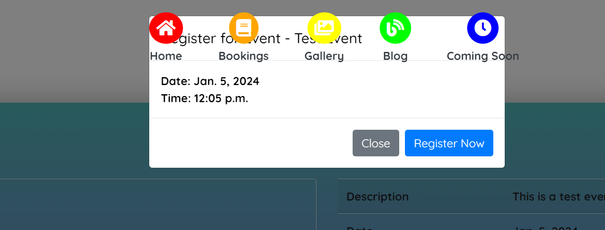

# Testing
- [Testing](#testing)
  - [Code Validation](#code-validation)
    - [HTML Testing](#html-testing)
    - [CSS Testing](#css-testing)
    - [Python Testing](#python-testing)
    - [JavaScript Testing](#javascript-testing)
  - [Browser Compatibility](#browser-compatibility)
  - [Responsiveness Test](#responsiveness-test)
  - [Fixed Bugs](#fixed-bugs)
  - [Unfixed Bugs](#unfixed-bugs)
  - [Additional Testing](#additional-testing)
    - [Lighthouse](#lighthouse)
    - [Results from Lighthouse](#results-from-lighthouse)
    - [User Stories Testing](#user-stories-testing)

# Code Validation

All of my code for SENspired was tested using the relevant tools. For my HTML the testing was done through [W3C HTML Validator](https://validator.w3.org), The CSS through [W3C CSS Validator](https://jigsaw.w3.org/css-validator/) and the JS file was check in [JS Hint](https://jshint.com/). Python files were tested in [Python Linter](https://pep8ci.herokuapp.com/#).

### HTML Testing

| Page | Result | Img |
| ---- | ---------- | --------- | 
| index.html | pass | [IMAGE](/media/testingimages/HTMLfix.png)|
| booking_form.html | pass | [IMAGE](/media/testingimages/booking_form.html.png)|
| booked_list.html | pass | [IMAGE](/media/testingimages/booked_list.html.png)|
| account_edit.html | pass | [IMAGE](/media/testingimages/account_edit.html.png)|
| account_overview.html | pass | [IMAGE](/media/testingimages/account_overview.html.png)|
| coming_soon.html | pass | [IMAGE](/media/testingimages/coming_soon.html.png)|
| event_list.html | pass | [IMAGE](/media/testingimages/event_list.html.png)|
| event_public_detail.html | pass | [IMAGE](/media/testingimages/event_public_detail.html.png)|
| 404.html | pass | [IMAGE](/media/testingimages/404.html.png)|

### CSS Testing

### Javascript Testing

As I'm using JQuery, some of the results came off as inaccurate. However, both would pass and work as planned. 

 

### Python Testing

**event app**

|     <b>Page</b>   | admin.py| forms.py | models.py | urls.py | views.py | 
| ------ | ---------- | ------------- | --------- | -------- | --------------- |
| <b>Pass?</b> | &check; | X |&check; | X | X | 
| <b>Result</b>| [PASS](media/testingimages/admin.py.png) | [1 ERROR](media/testingimages/forms.py.png) | [PASS](media/testingimages/models.py.png) | [12 ERRORS](media/testingimages/urls.py.png) | [5 ERRORS](media/testingimages/views.py.png) |
| <b>Reason</b>| N/A | Line too long | N/A | All Lines too long | Lines too long |
## Browser Compatibility

The website was tested on the following browsers: Google Chrome, Safari, Microsoft Edge and Mozilla Firefox. There were no errors discovered in the functionality of the site or the individual features.

| App | Browser Compatibility |
| ---- | ---------- |
| Google Chrome | &check; | 
| Safari | &check; | 
| Microsoft Edge| &check; | 
| Mozilla Firefox| &check; | 

[Back to top](#testing)

## Responsiveness Test

Testing of responsive design was carried out manually by utilizing [Google Chrome DevTools](https://developer.chrome.com/docs/devtools).

|        | S Galaxy 5 | iPhone 6/6S/7 | iPad Mini | iPad Pro | Display <1200px | Display >1200px |
| ------ | ---------- | ------------- | --------- | -------- | --------------- | --------------- |
| Render | &check;       | &check;          | &check;      | &check;     | &check;            | &check;            |
| Images | &check;       | &check;          | &check;      | &check;     | &check;            | &check;            |

## Fixed Bugs

While conducting testing, I identified and promptly addressed the following bugs. Fortunately, the overall process proved more manageable than anticipated, attributed to my consistent scrutiny of the code and meticulous double-checking.

The recurring issue stemmed from the positioning of the navbar, a hurdle swiftly overcome by strategically applying a Z-Index to the pertinent divs. This not only elevated them to the top but also involved a deft touch, incorporating margins where needed. The solution seamlessly addressed the challenge, resulting in an improved and harmonious layout.

## Unfixed Bugs

At the time of testing there are no unfixed bugs. 

## Additional Testing
### Lighthouse

The application was also tested using [Google Lighthouse](https://developers.google.com/web/tools/lighthouse) in Chrome Developer Tools. The following aspects were tested:

- Performance - reveals how the site performs during loading
- Accessibility - shows if the site if accessible for all users and suggests ways to improve it
- Best Practices - indicates if the site conforms to industry best practices
- SEO - Search Engine Optimisation - shows if the site is optimised for search engine result rankings

### Results from Lighthouse
| Page | Validation Results |
| ---- | ---------- |
| Home Page |[RESULT](media/testingimages/lighthouse-homepage.png) |
| Account Edit|[RESULT](media/testingimages/lighthouse-account_edit.png) |
| Account Overview | [RESULT](media/testingimages/lighthouse-account_overview.png) |
| Booking Form | [RESULT](media/testingimages/lighthouse-booking_form.png) |
| Coming Soon| [RESULT](media/testingimages/lighthouse-coming_soon.png) |
| Event Public Detail | [RESULT](media/testingimages/lighthouse-event-public-detail.png) |

## User Stories Testing

### User Access Stories
| Status | **User Access**
|:-------:|:--------|
| &check; | As a **user**, I would like to **view the apps homepage** so that I can **learn about the app and see what services it provides**.
| &check; | As a **user**, I would like to **view the apps homepage** so that I can **learn about the app and see what services it provides**.
| &check; | As a **user** I can **locate the navigation area** so that I can **easily access different parts of the website**
| &check; | As a **user**, I can **access relevant information about contact information and social media links without having to scroll back to the top of the page** so that I can **visit SENspired, contact SENspired and follow SENSpired online**.
| &check; | As an **unregistered user** I want to be able **to sign up onto the website** so that I can **access websites functionality and content**.
| &check; | As a **registered user** I want to be able **to sign in into my account** so that I can **get access to the website's functionality and options**.
| &check; | As a **signed in user** I want to be able **to sign out of my account** so that I can **keep my account private and safe**.
| &check; | As a **signed in user with an active profile** I can **create a booking request** so that **I can see the my bookings area to check in for updates.**
| &check; | As a **user**, I can **edit my booking request** as long as the status isn't approved, to **update my preferences regarding the booking time, date and name**.
| &check; | As a **registered user** I can **press delete button on my request** so that I can **delete all provided information regarding my booking**
| &check; | As a **registered user** I can **press delete button on my user profile** so that I can **delete all provided information regarding my contact details**.
| &check; | As a **user**, I can **edit my user profile** to **update my personal details**.
| &check; | As a **user** I can **open the events booking** so that I can **register for an event**.
| &check; | As a **user** I can **be visually attracted to the app and see the main site features** so that I can **quickly get an idea what the app offers**.
| &check; | As a **user I want to be informed about different user actions** so that I can **be sure that the intended action took place**.
| &check; | As a **user** I can **enjoy browsing the webpage while looking for information** so that **I don't feel compelled to leave**.
| &check; | As a **user** I want to **press a cancel button which will take me to the previous page** so that I **don't have to use the Back button**.
| &check; | As a **user** I can **easily understand what the table labels mean** so that I can **avoid any unnecessary confusion**.

### Admin Access Stories

| Status | **Admin Access**
|:-------:|:--------|
| &check; | As the **site owner**, I want to be able to **sign in to my account so that I can get access to the website's functionality and options**.
| &check; | As a **signed-in site owner**, I want to be able to **sign out of my account so that I can keep my account private and safe**.
| &check; | As a **signed-in site owner** via the **admin panel**, I can **create events with a name, description, time, date and image**.
| &check; | As a **signed-in site owner** via the **admin panel** , I can **Edit the events name, description, time, date and image**.
| &check; | As a **signed-in site owner** via the **admin panel**, I can **delete the events name, description, time, date and image**.
| &check; | As a **signed-in site owner** via the **admin panel**, I can **View requests made by general users for room bookings**.
| &check; | As a **signed-in site owner** via the **admin panel**, I can **approve requests made by general users for room bookings**.
| &check; | As a **signed-in site owner** via the **admin panel**, I can **delete requests made by general users for room bookings**.

[Back to top](#testing)